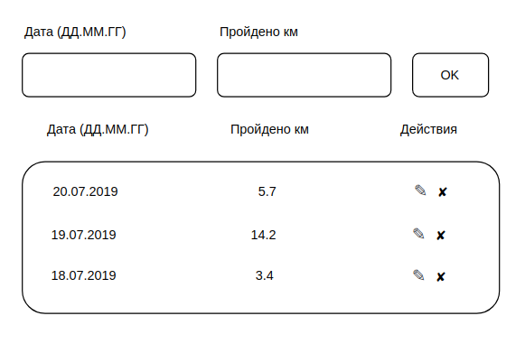

Training records
===

You decide to implement a small application that stores data about the workouts and walks you take during the week.

The general interface should look like this:

## Adding data

You should have an input form in which you enter the date and number of kilometers traveled. New values are added to the table when the form is submitted.

_Features of addition_:
1. New values are added not at the end, but according to sorting by date, that is, if we add 07/21/2019, then the value will be in the first position, according to the screenshot, and if 07/17/2019 - then in the last.
2. If we add values indicating an already existing date, then the values are summed up with those stored in the table, for example, if we add 07/20/2019 and 10 km, then for the date 07/20/2019 15.7 km will be displayed.

## Deleting data

Using the ✘ icon it should be possible to delete a line. The entire row and the data associated with it are deleted.

## Editing data

Additional, optional task: you can implement an edit button ✎, when clicked, the data is transferred to the input form and then saved when the Ok button is clicked.